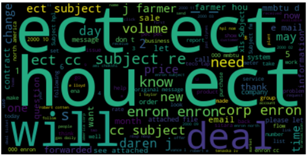
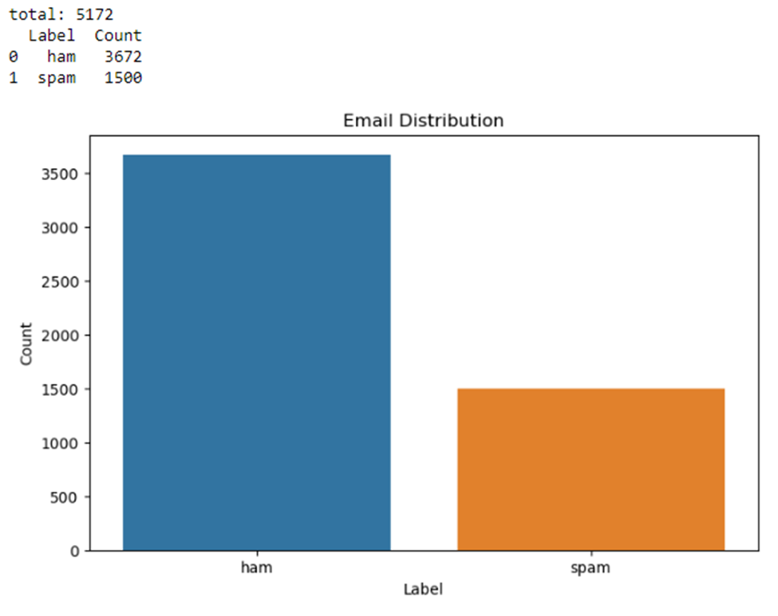
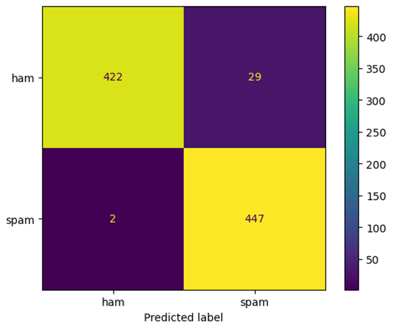

# Spam Detection using Natural Language Processing

## Overview
This project aims to create a model that can accurately classify emails as either spam or ham using Natural Language Processing (NLP) techniques. By analyzing the subject and body of emails, we build various feature sets and utilize machine learning algorithms to detect spam with high accuracy.

## Table of Contents
- [Introduction](#introduction)
- [Data](#data)
- [Libraries Used](#libraries-used)
- [Data Retrieval and Exploration](#data-retrieval-and-exploration)
- [Data Preprocessing](#data-preprocessing)
- [Feature Engineering](#feature-engineering)
- [Model Training and Evaluation](#model-training-and-evaluation)
- [Results](#results)
- [Conclusion](#conclusion)
- [Authors](#authors)
- [Usage](#usage)
- [License](#license)

## Introduction
Spam emails are a significant threat to both individuals and organizations. They often carry malware that can damage or gain unauthorized access to systems, leading to financial loss and compromised data. This project focuses on using NLP to classify emails as spam or ham to help mitigate these risks. We use the Enron-Spam dataset, which contains emails from Enron employees, categorized into 'ham' and 'spam'.

## Data
The dataset used is the Enron-Spam dataset. It includes 5172 emails, stored in folders labeled 'ham' (legitimate emails) and 'spam' (spam emails).

## Libraries Used
- `os`, `sys`: For file handling and system operations.
- `random`, `pandas`: For data manipulation and organization.
- `nltk`: For text processing and tokenization.
- `matplotlib.pyplot`, `seaborn`, `wordcloud`: For data visualization.
- `sklearn`: For building and evaluating machine learning models.

## Data Retrieval and Exploration
We started by extracting emails from the dataset and storing them in a list called `raw_data_list`. Each email was labeled as either 'ham' or 'spam'. We used various visualizations, such as word clouds and bar plots, to understand the distribution and common words in the dataset.

Th eimage below is the wordcloud from the Enron-Spam dataset.



Below is the distribution of spam versus ham emails in the dataset.



## Data Preprocessing
Preprocessing steps included:
1. **Shuffling Data**: Ensuring random selection of training and test sets.
2. **Balancing the Dataset**: Creating a balanced dataset with equal numbers of 'ham' and 'spam' emails.
3. **Tokenization**: Breaking down the email text into tokens (words).
4. **Stop Words Removal**: Removing common words that do not contribute to classification.

## Feature Engineering
We created several features to aid in the classification:
1. **Unigram Features**: Frequency of individual words in the emails.
2. **Verb Phrase Features**: Extracting verb phrases to capture calls to action often found in spam.
3. **Punctuation Features**: Counting punctuation marks which might indicate spam.

## Model Training and Evaluation
We used the Naive Bayes classifier for model training. To evaluate the model, we applied cross-validation and generated confusion matrices to visualize the performance. The evaluation metrics included accuracy, precision, recall, and F1 scores.

## Results
The models were evaluated using different feature sets:
- **Unigram Features**: Achieved classification accuracy around 95.42%.
- **Verb Phrase Features**: Less accurate compared to unigrams.
- **Punctuation Features**: Second most accurate model after unigrams.
- **Combination of Verb Phrases and Punctuation**: Improved accuracy over individual use.

The balanced dataset models performed slightly better, achieving around 96.33% accuracy. Below is the confusion matrix from the balanced dataset.



## Conclusion
Natural language processing is effective in detecting spam emails. Our best model, based on unigram frequency distributions, achieved high accuracy. Future improvements could include integrating more grammatical elements, such as noun phrases and adjective phrases, into the feature sets.

## Authors
- **Devyn Hughes**
- **Sean Deery**

## Usage

1. Clone the repository:

```
git clone https://github.com/sdeery14/spam-classification.git
```

2. Navigate to the project directory:

```
cd spam-classification
```

3. Install requirements

```
pip install -r requirements.txt
```

4. Run the spam classification:

```
python notebooks/spam-classification.py
```


## License
This project is licensed under the MIT License - see the [LICENSE](LICENSE) file for details.
